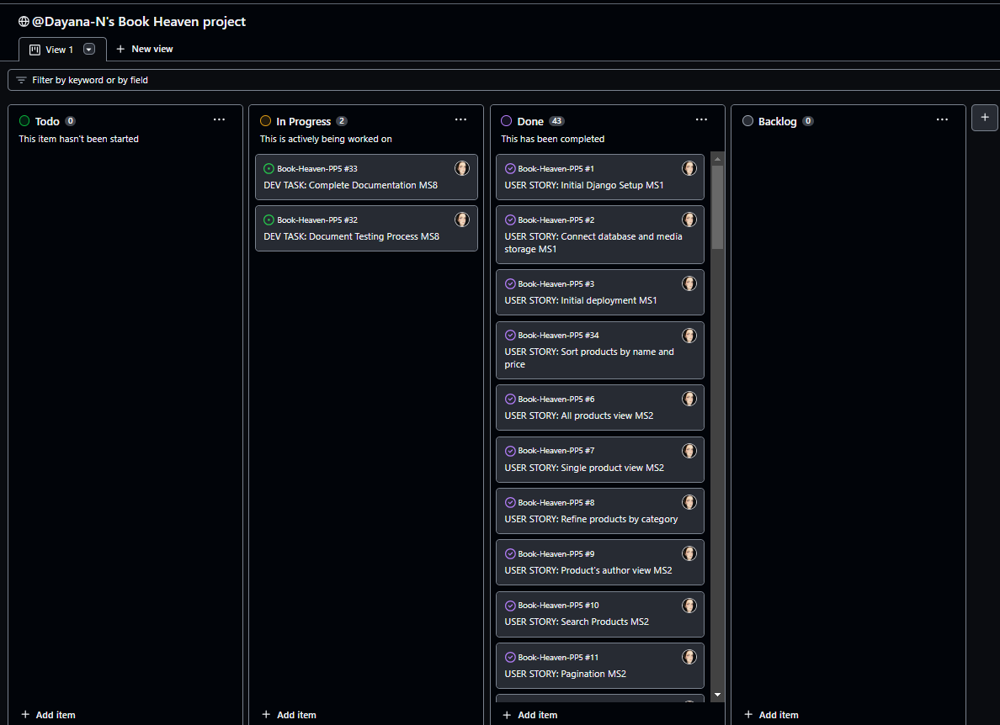

# Book-Heaven-PP5

[Link to deployed site](https://book-heaven-e537b3f88787.herokuapp.com/)
Book Heaven is an online book shop, built using Python, Django, HTML, CSS, JavaScript, Amazon S3 and Stripe. 

# Table Of Content

-   [User Experience](#user-experience)
    -   [User Stories](#user-stories)
    -   [Site Goals](#site-goals)
    -   [Scope](#scope)
-   [Design](#design)
    -   [Colour Scheme](#colour-scheme)
    -   [Database Schema](#Database-Schema)
    -   [Fonts](#Fonts)
    -   [Wireframes](#Wireframes)
    -   [Agile Methodology](#Agile-Methodology)
         -   [Overview](#overview)
         -   [EPICS(Milestones)](#epicsmilestones)
         -   [User Stories issues](#user-stories-issues)
         -   [MoSCoW prioritization](#moscow-prioritization)
         -   [GitHub Projects](#github-projects)
-   [Features](#features)
    -   [Navbar](#Navbar)
    -   [Footer](#Footer)
    -   [Home](#Home)
        -   [Hero Section](#hero-section)
        -   [Search Form](#search-form)
        -   [Product Card](#product-card)
    -   [Profile Page](#profile-page)
    -   [Sign In Page](#sign-in-page)
    -   [Sign Up Page](#sign-up-page)
    -   [Sign Out Confirmation](#sign-out-confirmation)
    -   [Password reset](#password-reset)
    -   [Password reset email sent](#password-reset-email-sent)
    -   [Enter a new password](#enter-a-new-password)
    -   [Password Reset Completed](#password-reset-completed)
    -   [Error Pages](#error-pages)
-   [Future Features](#future-features)
-   [Marketing](#marketing)
-   [Search Engine Optimization SEO](#search-engine-optimization-seo)
-   [Testing](#testing)
-   [Bugs](#Bugs)
-   [Technologies And Languages](#technologies-and-languages)
    -   [Languages Used](#languages-used)
    -   [Python Modules](#python-modules)
    -   [Technologies and programs](#technologies-and-programs)
-   [Deployment](#deployment)
    -   [Before Deployment](#before-deployment)
    -   [Deployment on Heroku](#deployment-on-heroku)
    -   [Creating A Fork](#creating-a-fork)
    -   [Cloning Repository](#cloning-repository)
-   [Credits](#credits)
    -   [Media](#media)
    -   [Code](#code)
    -   [Acknowledgements](#acknowledgements)
    -   [Comments](#comments)

## User Experience

### User Stories
1. As a developer I can setup a new Django project so that I can create the project's structure
2. As a developer I can connect database and media storage so that the user's stored data is stored successfully
3. As a developer I can deploy the application early so that I can confirm that the initial setup is working and can continue testing the application during development
4. As a User I can navigate through the website so that I can access different sections efficiently
5. As a user I can visit the home page so that I can identify the purpose of the website
6. As a user I want to be able to view a list of all available products in the bookshop so that I can browse and choose books to purchase
7. As a user I want to be able to view detailed information about a single product so that I can make an informed decision before purchasing
8. As a user I want to be able to refine the list of available products by selecting a specific category so that I can easily find books that match my interests
9. As a User I want to be able to view detailed information about a product's author, including their name, a short biography, and a list of books available for sale on the website so that I can learn more about the author and explore their other works.
10. As a User I want to be able to search for products in the bookshop by entering keywords so that I can quickly find specific books or topics of interest
11. As a User I want to be able to browse through a large list of products in the bookshop so that I can view all books in an organised way
12. As a an authenticated user I want to be able to add a review for a book product so that I can share my feedback and experiences with other potential buyers
13. As a user I want to be able to register an account so that I can have access to all functionality of BookHeaven.
14. As a user, I want to be able to log in to my account so that I can access my personalized features and make purchases on BookHeaven.
15. As a registered user I want to be able to reset my password so that I can regain access to my account in case I forget my password
16. As a registered user I want to be able to see my profile page so that I can update my information
17. As a authenticated user, I want to be able to save books to my wishlist so that I can revisit and consider purchasing them later on BookHeaven.
18. As a user, I want to be able to add products to my shopping cart so that I can conveniently review and purchase multiple items at once on BookHeaven.
19. As a user, I want to be able to remove products from my shopping cart so that I can adjust my order before making a purchase on BookHeaven.
20. As a user, I want to be able to adjust the quantity of products in my shopping cart so that I can control the quantity of items I want to purchase on BookHeaven.
21. As a user, I want to be able to apply discount codes to my orders so that I can enjoy savings and discounts on my purchases at BookHeaven.
22. As a user, I want to be able to securely make payments using Stripe so that I can complete my purchases on BookHeaven with confidence.
23. As an administrator, I want to have access to an admin dashboard so that I can monitor and view simple statistics related to the orders made on BookHeaven.
24. As an administrator, I want to be able to add new products to the website so that I can expand the product catalog on BookHeaven.
25. As an administrator, I want to be able to remove products from the website so that I can manage the product catalog on BookHeaven.
26. As an administrator, I want to be able to edit existing products on the website so that I can update and manage the product catalog on BookHeaven.
27. As an administrator, I want to be able to edit the stock levels of products so that I can manage inventory and ensure product availability on BookHeaven.
28. As a user, I want to be able to submit a testimonial about my overall experience with the website so that I can provide feedback and share my positive experiences on BookHeaven.
29. As a user, I want to be able to view testimonials submitted by other users so that I can read about the experiences and feedback of fellow users on BookHeaven.
30. As a website owner, I want to improve the website's search engine optimization (SEO) so that the website can rank higher in search engine results and attract more organic traffic.
31. As a user, I want to sign up for newsletters on the website so that I can keep up with updates and deals.
32. As a user I want to be able to sort the list of available products by name and price so that I can easily find books that match my interests
33. As a User I want to be able to complete the checkout process for my shopping cart so that I can purchase the items I've added to my cart
34. As a an authenticated user I want to be able to delete my reviews for a book product so that I can manage and maintain the accuracy and relevance of my feedback
35. As a an authenticated user I want to be able to edit my reviews for a book product so that I can manage and maintain the accuracy and relevance of my feedback

### Site Goals
1. To provide users with a place to purchase books of their interest.
2. To provide the users the ability to search and browse books and authors.
3. To provide the users with the ability to save books to their wishlist
4. To provide the users with the ability to check their order history.
5. To provide the users with the most recents titles on the market.
6. To provide the users with the ability to leave a feedback for books they have purchased.

### Scope
The project aims to develop an e-commerce website offering books to customers. The website will be responsive and user-friendly, providing the user with the ability to:
 - Register and Login
 - Reset Password
 - Browse, search and refine books for sale
 - Add books to shopping cart
 - Apply discount codes
 - View product stock levels
 - Update quantity in shopping cart
 - Delete items from shopping cart
 - Pay for items securely by using the integrated Stripe payment system
 - Save books to wishlist
 - Update personal information
 - View past orders

Key Features:

1. Initial Project Setup:
- Developers can set up a new Django project to create the project's structure.
- Database and media storage will be connected to ensure data storage and retrieval.
- An early deployment of the application will be carried out to confirm the initial setup's functionality.
2. Products:
- Users can view books for sale and refine them by category and genre
- Users can sort products by price, title, genre or category
- Users can view details about each product including image, description, author, stock level and reviews
- Search products by title, author or description
- Registered users can leave reviews.
3. User Authentication:
- Users can register an account, allowing them access to all of the website's functionality.
- Registered users can login and access wishlist, reviews, past orders and saving personal details.
- Users can reset their password
- Users can add or remove items from their wishlist
4. Orders and checkout:
- Users can add items to their shopping cart
- Users can update the quantity of the items in the shopping cart
- Users can remove products from their shoppingcart
- Users can apply discount codes
- Users can use secure checkout functionality to pay for their items
5. Admin functionality:
The functionality in this section is limited to superusers or admins.
- Admins can access the admin dashboard, containing of a list of products and summary of orders and revenue.
- Admins can add products (books) for sale.
- Admins can delete products from the system.
- Admins can edit products and stock levels.
- Admins can access Orders section, where the order status can be updated.
- Admins can sort orders by status (In Progress, Completed, Cancelled)
- Admins can access the discount codes page, where codes can be created, deactivated or deleted.
6. Notification Messages:
Users will receive notification messages when performing CRUD operations, login/logout, and signup actions.

Benefits:

1. User-Centric Experience: The platform focuses on the user's needs, allowing efficient browsing and product purchasing.
2. Efficient Navigation: Users can easily navigate through different sections of the website for seamless access.
4. Effective Communication: Sending emails and notification messages features, enhances user interaction.

## Design
### Colour Scheme
The website harmoniously blends warm tones of light coral and red-orange with accents of light grey and white, all anchored by a cool grey undertone. This carefully curated color scheme establishes a sense of vibrancy and professionalism while ensuring a visually engaging experience for the users.
The main colours set as variables are

    1. --orange: #f58669;
    2. --dark-orange: #de502c;
    3. --white: #ffff;
    4. --brown: #63453d;
    5. --background: #ebeae5;
    6. --gray: #938c8c;

The below colours were used to compliment the main colours. Due to the fact that these colours have been used with very little repetition, there was no need to set them as variables
- #6f6a6a
- #2b221f
- #333
- #0d0d0d
- #888
- #97908e
- #eeebe3
- #8f8f8f
- #a5d9a5
- #f1f1f1
- #ff7a7a
- #cdc8c8
- #f0bc00
- #aab7c4
- #c7dbd2
- #eccccf
- #f2e8c5
- #dc3545
- #c5d7f2

### Database Schema

1. User:
The User model is part of Django Allauth. The model comes with predefined fields as standard. Some of them are username, email, name, password, and more. This model is used for user authentication, hence why changes directly to this model are not advisory. The User model is connected to the UserProfile model with one to one relationship.

2. UserProfile:
The UserProfile model is a custom custom-created model to handle the user profile details. Signals are used to reflect the changes between the User and UserProfile models.

3. Category
This model was created for the purpose of defining categories for the products

4. Genre
This model was created to add genre section for the products. It is connected to Category with a ForeignKey

5. Author
This model stores the infor for each author. It consist of name, image, bio and id.

6. Book
This is a custom product model. It is connected to Genre as a ForeignKey and author as ManyToManyField. This allows adding more than one author per book. In addition to that it has fields for handling stock. Stock_amount holds the integer value of the stock levels. In_stock is a Boolean field which sets the product to being in stock or not. A method called product_in_stock determines if a product is in stock based on the stock_amount value. The result of this method updates the in_stock boolean field. 

7. Wishlist
This model stores the books or products to a wishlist for authenticated users. It is connected to UserProfile and Book models as a ForeignKey

8. ProductReview 
This model stores the user's reviews for a product. It is connected to the UserProfile and the Book models as a ForeignKey

9. Order 
This model holds all the information of the user's order. It is connected to the UserProfile as a ForeignKey.

10. OrderStatus
This model is connected to the Order model with OneToOneField. When an Order is created a signal creates OrderStatus. The default value is 'in progress' with additional options of Completed and Cancelled. 

11. OrderLineItem
This model is connected to the Order and Book as a ForeignKey. It is created for each item in the order

12. DiscountCode
This model has no specified relationship to the other models. It contains three fields - code, discount and active. It allows the admin to create discount codes, determine the amount of a discount and if the code is active. 

### Fonts
In addition to Bootstrap 5 built in font family the below two fonts were used throughout the application
1. Poppins

2. Libre Baskerville

### Wireframes
### Agile Methodology
#### Overview
This project was created using agile principles. As this is my second full-stack project, using agile, it was easier to identify the relevant milestones. Using the agile approach allowed me to plan all the features of the website through user stories. Each user story has acceptance criteria and tasks to clearly outline the requirements for each feature to be completed.

#### Epics(Milestones)
The user stories are grouped into eight EPICS or Milestones. An additional Milestone called Project Backlog was created to manage any additional features, bugs, or tasks that may arise during development.

#### User Stories Issues
The structure of the user story issue consists of the user story, acceptance criteria, and tasks that outline the steps that are required for this issue to be completed. During development where possible, the commit messages are connected to their corresponding issues.

#### MoSCoW prioritization
This prioritization technique was used to effectively prioritize the features and requirements of the project based on their importance. The acronym "MoSCoW" stands for "Must have, Should have, Could have, and Won't have." Each category helps categorize and prioritize features to guide the development process and ensure that the most critical elements are addressed first.

#### GitHub Projects
The project was created using a basic Kanban Board structure, divided into columns such as Todo, In Progress, Done, and Backlog. This setup provides a clear and organized way to track the status of tasks and visualize and manage the workflow.

### Features
#### Navbar
The navbar was built using bootstrap 5 and it is fully responsive. The search bar allows the users to search for products by keywords from any page of the website. The My Account drop down gives the user the option to log in or sign up. If the user is authenticated additional menu options are displayed like my profile and admin (if the user is a superuser). The shopping cart icon is a link to the shopping cart and it also displays the total of the items in the cart.
The nav links allow the user to refine the products by category, genre, special offers or to browse through the authors page, FAQ and about us. The is a dropdown for special offers which allows the user to see the new arrivals and deals.

### Toasts
Toasts from Bootstrap were implemented to provide customers with feedback regarding their actions on the website.

### Breadcrumbs
The implementation of breadcrumbs allows users to keep track of their current location on the website. Breadcrumbs are present on most pages throught the website including the products pages. They are located on the top left corner of the page.

#### Footer
The footer consist of links to social media, business address and useful links including about us, faq, privacy policy and the main product categories

### Home Page
#### Hero Section
The hero section is the beginning of the whole customer's journey. That is why I made it a priority to create appealing hero section. 
The text on the left communicates the essence of BookHeaven, portraying it as a Dublin-based family business offering a diverse range of books for different audiences
The hero section image was designed using photoshop by combining images of book covers. The added shadows made the hero section blend well with the rest of the website.
This is then followed by call-to-action button Shop Now which invites the user to browse through the available products.

#### Trust Badges
The trust badges serve as visual indicators to reassure the visitors about specific aspects of the services available. Animation effect was added to the icons to make them more eye catching.

#### Products
The products displayed on the home page are the most recently added 8 products which are in stock.

#### Newsletter
The users can sign up to a newsletter to recieve the most recent offers and discount codes. The form was integrated using MailChimp.

### Products Page
The all books page renders all products to the user. They have the option to sort the products by title, price, genre and category. This page also displays the number of the products available. The pages, which refine the products by category or genre render the same template as all products, prefilled with the relevant data.
At the end of the products result there is pagination to help the user navigate easily through multiple pages of products

### Products Card
The product card consist of an image of the book cover, title, author and price. When hovered over the add to cart button appears at the bottom and a heart at the top to add to favourites. If the product is on sale, then the old price will be displayed with line through, followed by the new price and a little label at the top of the image showing the percentage of the discount.

### Single Products Page
On the page's left side, a product image is displayed. On the right side, the most important information about the product is displayed. This includes the title, author, publisher, reviews rating, price, stock levels, add to wishlist icon, and add to cart button with quantity dropdown. 
Implementing stock levels in the product model, allowed for adding custom logic when it comes to adding items to the cart. The user should not be able to add to their cart a higher quantity than the stock levels and this logic also needs to account for items already in the cart. If the user tries to add more than what is in stock an error message appears to notify that there is not enough stock to fulfill the order.
Below the top section, there is a section with tabs allowing the user to switch between description, details, and reviews. The reviews section allows an authenticated user to submit a review for a product. The overall rating is calculated and the number of starts are displayed in the top section of the page. Authenticated users can edit and delete their reviews from the same tab. 
The description tab includes a short description of the book which helps the users in making informed decision if they wish to purchase this book
The details tab includes some book information like ISBN number, number of pages, and language.

### Edit review page
This page allows the user to edit their review in the event they changed their mind. It renders prefilled with the original data. 

### Delete review confirmation
This page asks the user for confirmation if they wish to delete their review

### FAQ Page
The FAQ page consists of the most frequently asked questions.

### About Us Page
The About Us Page consists of a bookshop image followed by a short About Us description. Below that there is an embedded Google map with the location and contact details.

### All Authors Page
This page allows the users to browse through the available authors on the website.

### Author Page
This page allows the user to learn more about the author and find other books by this author available on the system.
It consists of the author's image, name, short bio, and product cards with the books available.

### My Profile Page
This section is accessible only to authenticated users.
This section contains three pages - my profile, my orders, and my wishlist

#### Profile
This page renders a form for the user's address and phone number. If the user has any details saved, it renders prefilled.

#### Order History
This page displays the past orders of this user.

#### My Wishlist
This page displays the items in the wishlist

